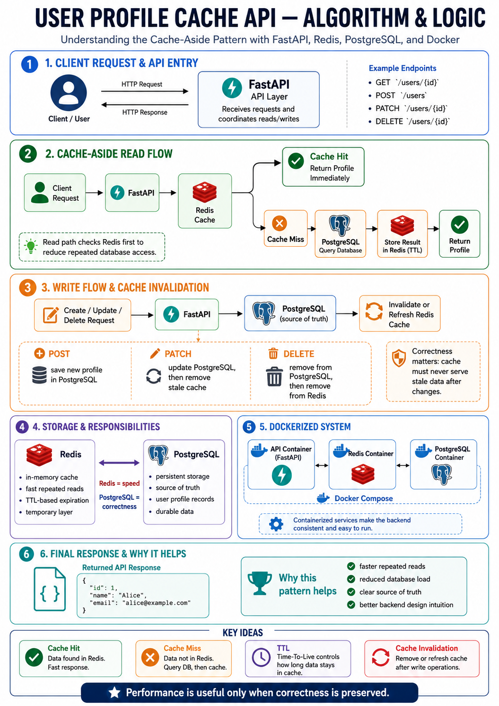
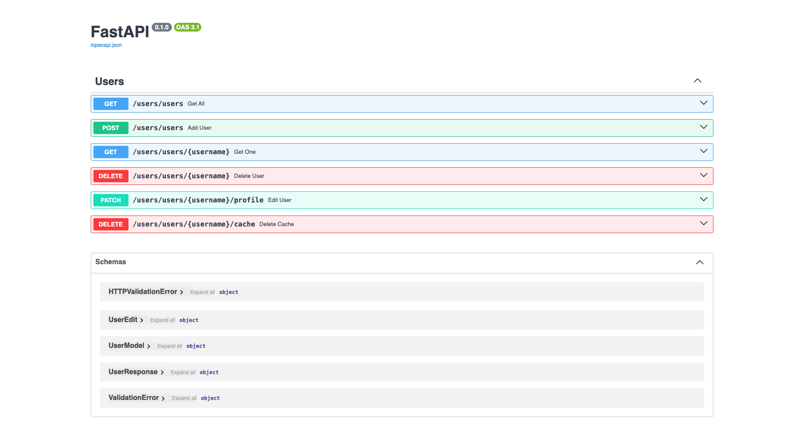
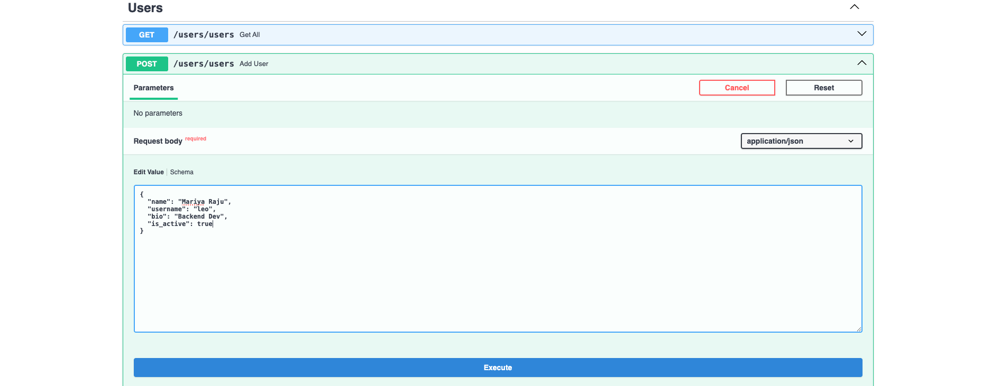
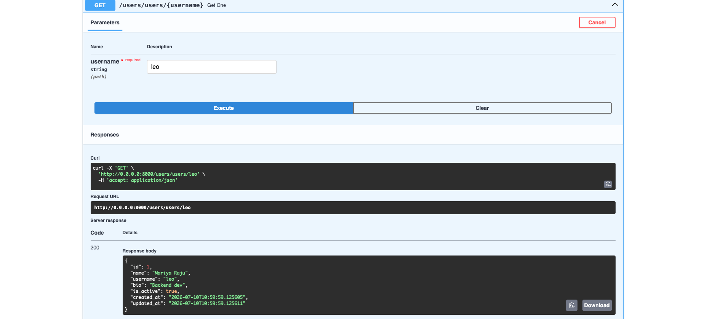

# User Profile Cache API

A backend project built to understand one important question:

**What should happen when the same data is requested again and again?**

Instead of treating this as another CRUD application, I used the project to learn how caching can make repeated reads faster while still keeping the data correct.

---

## Why I Built This

A normal API can read a user profile directly from the database every time it is requested.

That works.

But if the same profile is requested repeatedly, asking the database for the same information every time is unnecessary.

So this project introduces a cache between the application and the database.

The main idea is simple:

```text
Request
   ↓
Check Cache
   ↓
 ┌───────────────┐
 │               │
Hit             Miss
 │               │
Return       Read Database
                 ↓
             Save to Cache
                 ↓
               Return
```

The interesting part was not simply making reads faster.

The real challenge was making sure the cached data **never became stale after an update or delete**.

That is what made this project useful.

---

## The Main Idea — Cache Aside

The application follows a simple rule:

**Check the cache first. Use the database when needed.**

For a profile request:

```text
User Request
     ↓
FastAPI
     ↓
Redis
     ↓
Cache Hit?
   ↙     ↘
 Yes     No
 ↓        ↓
Return   PostgreSQL
          ↓
       Save Result
       in Redis
          ↓
        Return
```

When a profile changes:

```text
Update Database
      ↓
Remove Old Cache
      ↓
Next Request Gets Fresh Data
```

This keeps performance and correctness working together.

---

## Pipeline

> The clean architecture diagram for this section will show how **FastAPI, Redis, PostgreSQL, and Docker** work together.



---

## What the Project Can Do

- Create user profiles
- Retrieve all profiles
- Retrieve a single profile
- Cache frequently requested profiles
- Update part of a profile
- Delete profiles
- Automatically expire cached entries
- Remove stale cache after updates and deletes
- Run the application as multiple connected services
- Apply database migrations safely

---

## What Happens During a Read?

Imagine a user requests:

```text
/users/10
```

### First request

Redis does not have the profile yet.

```text
Request
   ↓
Redis
   ↓
MISS
   ↓
PostgreSQL
   ↓
Profile Found
   ↓
Store in Redis
   ↓
Return Profile
```

### Next request

```text
Request
   ↓
Redis
   ↓
HIT
   ↓
Return Profile
```

The second request avoids another database read.

---

## What Happens During an Update?

Caching introduces an important problem.

Suppose Redis contains:

```text
Name: Alex
Age: 21
```

Then the database is updated to:

```text
Name: Alex
Age: 22
```

If the cached version stays untouched, users may continue receiving the old value.

So after an update:

```text
Update PostgreSQL
       ↓
Delete Cached Profile
       ↓
Next Request
       ↓
Read Fresh Database Value
       ↓
Cache Again
```

This is **cache invalidation**.

It was one of the most important ideas I wanted to understand through this project.

---

## What Happens During a Delete?

The same rule applies when a profile is deleted.

```text
Delete From Database
        ↓
Delete From Cache
        ↓
Profile No Longer Exists
```

The cache should never behave as though deleted data still exists.

---

## Project Structure

```text
user_profile_api/
│
├── app/
│   ├── core/
│   │   ├── database.py
│   │   └── redis_client.py
│   │
│   ├── models/
│   │   └── user.py
│   │
│   ├── schemas/
│   │   └── profile_model.py
│   │
│   ├── routers/
│   │   └── user.py
│   │
│   └── main.py
│
├── alembic/
├── screenshots/
├── Dockerfile
├── docker-compose.yml
├── requirements.txt
├── .env
└── README.md
```

The application is split so database logic, caching, API routes, validation, and startup behaviour remain easy to understand independently.

---

## Running the Project

Clone the repository:

```bash
git clone https://github.com/imLeo007/user-profile-cache-api.git
cd user-profile-cache-api
```

Create your environment variables, then start the services:

```bash
docker compose up --build
```

Run the database migrations:

```bash
docker compose exec api alembic upgrade head
```

Open the API documentation:

```text
http://localhost:8000/docs
```

Live API:

```text
https://user-profile-cache-api.onrender.com/docs
```

---

## Application Preview

### API Overview



### Creating a User



### Reading a Cached User



---

## What I Learned

This project changed how I think about caching.

Before building it, caching looked like:

```text
Store data in Redis
→ make things faster
```

After building it, the real idea became:

```text
Read efficiently
        +
Keep cached data correct
        +
Know when the database must remain the source of truth
```

The important lesson was:

**Performance is useful only when correctness is preserved.**

---

## Why This Project Matters

This project was one of my first steps from building simple CRUD applications toward thinking about how backend systems behave as a whole.

It introduced several questions that matter in larger systems:

```text
Where should data come from?

What happens when cached data becomes old?

Which system is the source of truth?

When should cached information expire?

What should happen after an update or delete?

How should multiple services communicate?
```

Understanding those questions became more valuable than simply learning another library.

---

## Project Progression

```text
CRUD API
   ↓
Persistent Database
   ↓
Caching
   ↓
Cache Invalidation
   ↓
Multiple Services
   ↓
Deployment
   ↓
More Reliable Backend Systems
```

This project became an important foundation for the more complex backend and AI systems I started building afterward.

---

## Final Note

The purpose of this repository is not to demonstrate a complicated product.

It is to demonstrate a simple backend idea **properly**:

> Keep frequently requested data close to the application, keep the database as the source of truth, and make sure the two never disagree.

That principle looks simple on paper.

Building it made me understand why it matters.

---

## Links

**GitHub:**  
https://github.com/imLeo007/user-profile-cache-api

**Live API:**  
https://user-profile-cache-api.onrender.com/docs